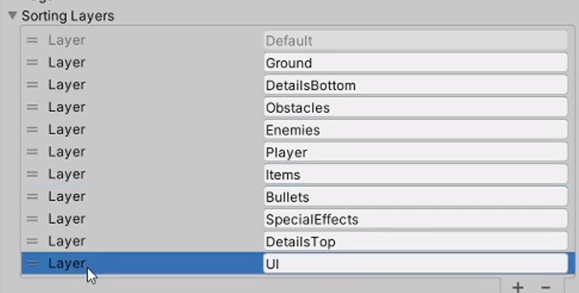

# TileMap
> [kenney: 一个非常可爱的资源站](https://www.kenney.nl/)  
> [superpowers：一个非常丰富的开源资源包](https://github.com/sparklinlabs/superpowers-asset-packs/tree/master)

重新设置瓦片
```yml
Pixels Per Unit: 128
Filter Mode: Point
Compression: None

```

下载 Tilemap 包

层级窗口种创建 Tilemap Rectangular Ground

创建一个调色板 Ground

barricadeMetal.png、barricadeWood.png 同样设置为瓦片同样的设置
```yml
Pixels Per Unit: 56
Filter Mode: Point
Compression: None

```
创建一个调色板 Obstacles

层级窗口种创建 Tilemap Rectangular Obstacles
```yml
Scale: 0.5 0.5 1;
```


创建一个调色板 Details

向 Obstacles 添加 TileMap Collider 2D、Composite Collider 2D

`Used By Composite: true`、`Body Type: Static`

搭建场景

> TileMap


# Movement

新建空游戏对象 Player

Player 新建子对象 Tank

Tank 新建子对象 TankBase 添加组件 Sprite Renderer
```yml
Sprite Renderer:
    Sprite: tankBody_green
    SortingLayer: Player
```

新建文件夹 Assets/Scripts

新建脚本 PlayerInput.cs 附加给 Player 游戏对象

> Sprite Renderer  

> UnityEvent


游戏对象 Tank 添加组件 Rigidbody 2D、Capsule Collider 2D 调整参数

游戏对象 Tank 新建子对象 TankTurretParent

TankTurretParent 新建子对象 TankTurret

TankTurret 添加组件 Sprite Renderer

```yml
Sprite Renderer:
    Sprite: tankBlue_bareel1
    Flip: Y
    SortingLayer: Player
```

调整位置 TankTurretParent TankTurret

新建脚本 TankController.cs

> 输入的获取在输入类（能力）Update 获取，行为在处理类（游戏实体）FixedUpdate 中处理

> 控制（数据）与行为（业务）分离

附加 TankController.cs 到 Tank 游戏对象

Tank 游戏对象附加给 Player 游戏对象的事件序列化字段 

# Adding acceleration (加速度) to player movement

新建脚本 TankMove.cs AimTurret.cs Turret.cs

游戏对象 TankBase 附加脚本 TankMove.cs

游戏对象 TankTurretParent 附加脚本 AimTurret.cs

游戏对象 TankTurret 附加脚本 Turret.cs


# Tank Shooting Mechanic in Unity

修改脚本 AimTurret.cs 炮管的旋转修正不再代码种而是面板的调整

游戏对象 TankTurret 新建子对象 Barrel

新建空游戏对象 Bullet ,Sprite Renderer Rigidbody、Box Collider

新建脚本 Bullet.cs 附加给游戏对象，制成预制体

修改脚本 Turret.cs

新建脚本 Damagable.cs 附加给游戏对象 Tank，制成预制体

> 可编程对象 ScriptableObject

# Collision Layers in Unity 2D

编写 Layer 
> 区分 Layer 和 Sort Layer

设置碰撞矩阵
> 碰撞作用矩阵

